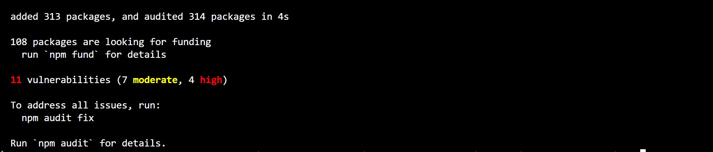
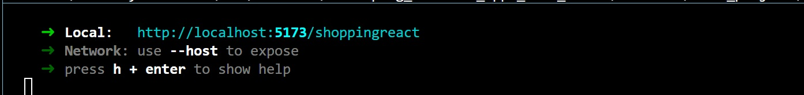

# Coursera Final Project for **Developing Front-End Apps with React**

## Assumptions:

- Using Visual Studio Code

## Steps to get the application running 

- git clone https://github.com/nyguerrillagirl/e-plantShopping.git
- cd do the folder e-plantShopping
- enter: npm install

Note: You will the above generated - don't panic. This is an older version of React and Redux.

- To start the project enter: npm run dev

- Open a browser and enter the "Local" url provided.

## Using the application

- Click on "Get Started" 
- Select plants to add to the "cart"
- View the "cart", add/decrease the number of items selected for a plant

## More information

- See docs/FINAL_PROJECT_NOTES.docx for information on requirement and how I implemented a solution.